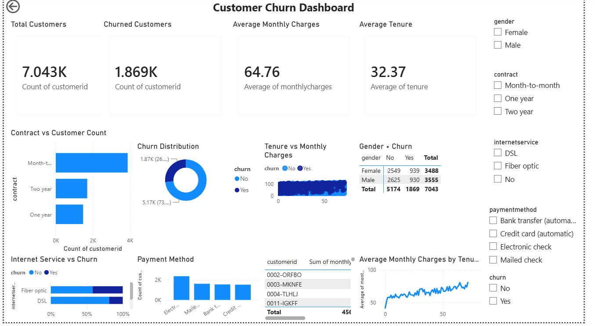
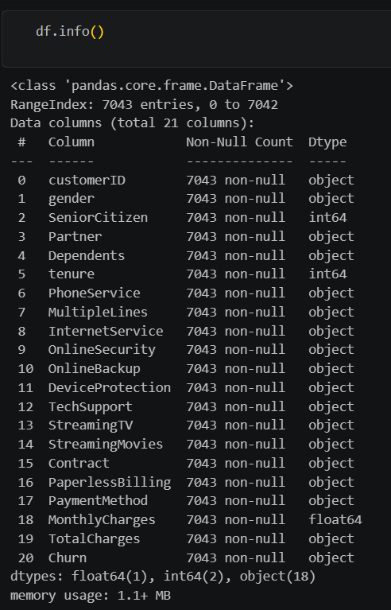
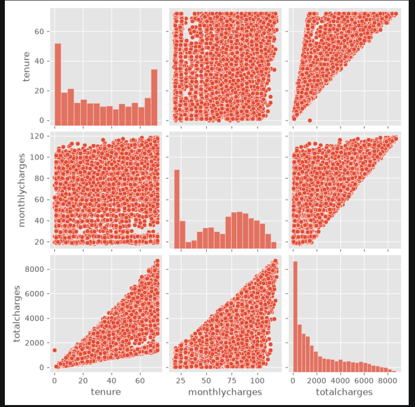
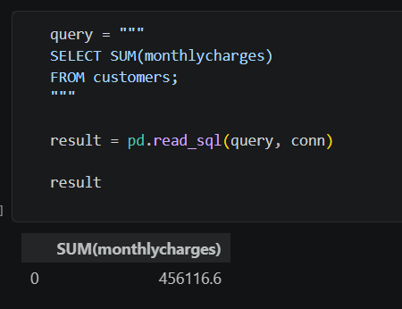
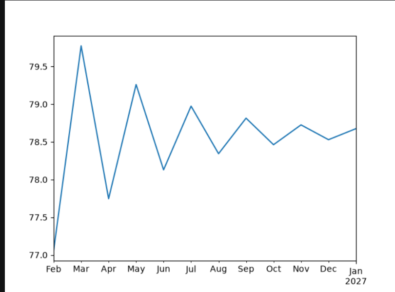
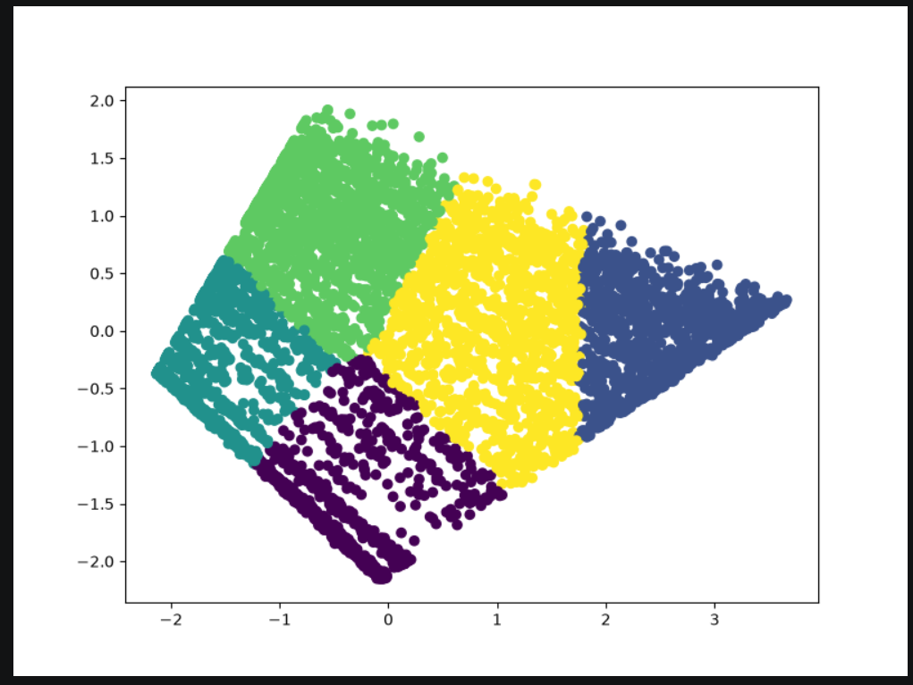
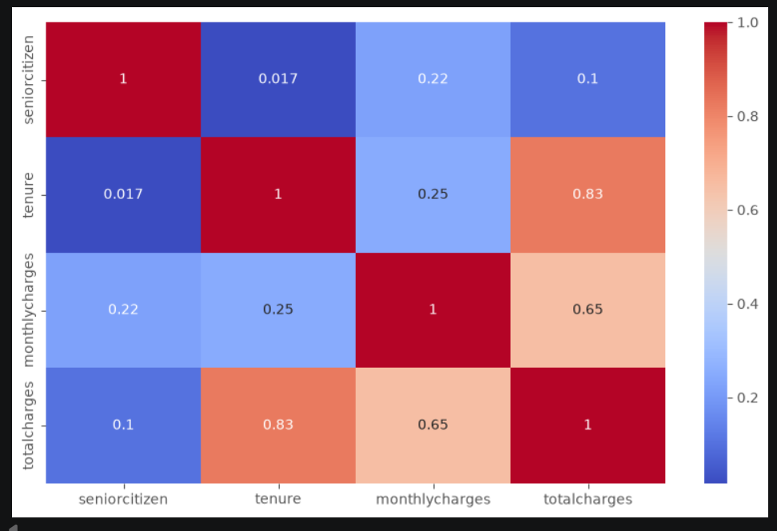
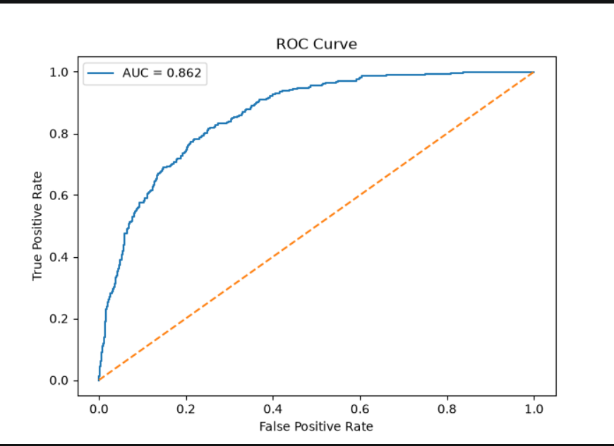

# 📊 ApexPlanet Data Analytics Internship Project

<div align="center">

# Customer Churn Analysis using IBM Telco Customer Churn Dataset

### 📈 End-to-End Data Analytics | SQL | Power BI | Machine Learning | Statistical Analysis


</div>

---

# 📌 Overview

This project was completed as part of the **45-Day Data Analytics Internship** conducted by **ApexPlanet Software Pvt. Ltd.**

The project presents a complete **end-to-end data analytics pipeline** using the **IBM Telco Customer Churn Dataset**. It demonstrates how raw customer data can be transformed into meaningful business insights through data preprocessing, exploratory data analysis, SQL-based querying, interactive dashboard development, statistical modeling, customer segmentation, predictive analytics, and workflow automation.

The primary objective is to identify the key factors influencing customer churn and provide actionable insights that can help telecommunication companies improve customer retention and support data-driven decision-making.

---

# 🚀 Project Highlights

- ✅ End-to-End Data Analytics Pipeline
- ✅ Customer Churn Prediction
- ✅ Exploratory Data Analysis (EDA)
- ✅ SQL-Based Business Analytics
- ✅ Interactive Power BI Dashboard
- ✅ Interactive Plotly Visualizations
- ✅ Statistical Analysis & Time Series Forecasting
- ✅ Customer Segmentation using K-Means Clustering
- ✅ Machine Learning Models
- ✅ KPI Automation Pipeline
- ✅ Executive Business Report
- ✅ Professional GitHub Repository

---

# 🎯 Project Objectives

The objectives of this project are to:

- Clean and preprocess raw customer data.
- Perform exploratory data analysis (EDA).
- Extract business insights using SQL.
- Build interactive dashboards in Power BI.
- Analyze customer behavior using statistical techniques.
- Forecast trends through time series analysis.
- Segment customers using K-Means Clustering.
- Develop machine learning models for churn prediction.
- Automate repetitive analytical tasks.
- Present actionable business recommendations.

---

# 📂 Dataset Information

| Attribute | Details |
|-----------|----------|
| **Dataset** | IBM Telco Customer Churn Dataset |
| **Domain** | Telecommunications |
| **Source** | Kaggle |
| **Format** | CSV |
| **Records** | 7,043 Customers |
| **Target Variable** | Churn |

### 🔗 Dataset Source

https://www.kaggle.com/datasets/blastchar/telco-customer-churn

---

# 💡 Problem Statement

Customer churn is one of the major challenges faced by telecommunication companies. Losing existing customers directly impacts revenue and increases customer acquisition costs.

This project analyzes historical customer data to identify patterns associated with churn, discover high-risk customer groups, and develop predictive models that can assist businesses in implementing effective customer retention strategies.

---

# 🛠 Technology Stack

## Programming Language

- Python

## Python Libraries

- Pandas
- NumPy
- Matplotlib
- Seaborn
- Plotly
- Scikit-learn
- SQLAlchemy
- Statsmodels
- Joblib
- OpenPyXL

## Database

- SQLite

## Business Intelligence

- Power BI Desktop

## Development Environment

- Jupyter Notebook
- Visual Studio Code

## Version Control

- Git
- GitHub

---

# 📁 Project Structure

```text
apexplanet-data-analytics/
│
├── dashboards/
│   └── PowerBI/
│       └── TelcoDashboard.pbix
│
├── data/
│   ├── raw/
│   │   └── WA_Fn-UseC_-Telco-Customer-Churn.csv
│   └── processed/
│       └── telco_cleaned.csv
│
├── database/
│   └── telco.db
│
├── images/
│   ├── dashboard.png
│   ├── eda.png
│   ├── data_cleaning.png
│   ├── sql_output.png
│   ├── kmeans.png
│   ├── time_series.png
│   ├── confusion_matrix.png
│   └── roc_curve.png
│
├── models/
│   ├── logistic_regression.pkl
│   ├── decision_tree.pkl
│   ├── linear_regression.pkl
│   └── kmeans.pkl
│
├── notebooks/
│   ├── Task1_EDA.ipynb
│   ├── Task2_SQL.ipynb
│   ├── Task3_Visualization.ipynb
│   └── Task4_Statistical_Modeling.ipynb
│
├── reports/
│   ├── Executive_Report.pdf
│   ├── Cleaning_Log.md
│   ├── Task2_SQL_Report.md
│   ├── Task3_Dashboard_Report.md
│   └── Task4_Statistical_Modeling_Report.md
│
├── scripts/
│   ├── automation_pipeline.py
│   └── db_utils.py
│
├── sql/
│   └── task2_queries.sql
│
├── visualizations/
│   ├── html/
│   └── png/
│
├── README.md
├── requirements.txt
├── LICENSE
└── .gitignore
```

---

# 🔄 Project Workflow

```text
IBM Telco Customer Churn Dataset
                │
                ▼
      Data Cleaning & Preprocessing
                │
                ▼
 Exploratory Data Analysis (EDA)
                │
                ▼
      SQL Business Analysis
                │
                ▼
 Statistical Analysis & Forecasting
                │
                ▼
 Customer Segmentation (K-Means)
                │
                ▼
 Machine Learning Models
                │
                ▼
 Interactive Visualizations
                │
                ▼
      Power BI Dashboard
                │
                ▼
 KPI Automation Pipeline
                │
                ▼
 Executive Business Report
```

---

# 📊 Repository Statistics

| Component | Count |
|-----------|------:|
| Jupyter Notebooks | 4 |
| Machine Learning Models | 4 |
| SQL Scripts | 1 |
| Power BI Dashboards | 1 |
| Interactive Plotly Charts | 4 |
| Static Visualizations | 22+ |
| Reports | 5 |
| Database | 1 |
| Python Scripts | 2 |
| Dataset Files | 2 |

---
# ✅ Internship Tasks Completed

The project was completed through **five structured internship tasks**, each focusing on a different aspect of the Data Analytics lifecycle.

---

# 📌 Task 1 – Data Collection, Cleaning & Exploratory Data Analysis (EDA)

### Objectives

- Set up the analytics environment.
- Understand the dataset.
- Clean and preprocess raw customer data.
- Perform exploratory data analysis.
- Discover meaningful business patterns.

### Activities Performed

- Imported IBM Telco Customer Churn Dataset
- Checked missing values
- Removed duplicate records
- Converted data types
- Handled inconsistent values
- Generated descriptive statistics
- Performed univariate and bivariate analysis
- Visualized customer distributions

### Tools Used

- Python
- Pandas
- NumPy
- Matplotlib
- Seaborn

### Outputs

- Cleaned Dataset
- Data Cleaning Report
- EDA Notebook
- Statistical Summary
- Visualization Charts

---

# 📌 Task 2 – SQL Database & Business Analysis

### Objectives

- Store processed data in a relational database.
- Perform business-oriented SQL analysis.
- Extract actionable customer insights.

### Activities Performed

- Created SQLite Database
- Imported cleaned dataset
- Executed SQL queries
- Used Aggregate Functions
- GROUP BY Analysis
- HAVING Clause
- Subqueries
- Common Table Expressions (CTEs)
- Window Functions
- SQL Optimization
- Integrated SQL with Python

### Tools Used

- SQLite
- SQLAlchemy
- Python

### Outputs

- SQLite Database
- SQL Scripts
- SQL Report
- Business Insights

---

# 📌 Task 3 – Data Visualization & Dashboard Development

### Objectives

- Visualize customer behavior.
- Build an interactive business dashboard.
- Present KPIs in an intuitive format.

### Activities Performed

- Created 15+ Python visualizations
- Generated Interactive Plotly Charts
- Built Power BI Dashboard
- Added KPI Cards
- Designed Interactive Filters
- Created Business Reports

### Visualizations Created

- Churn Distribution
- Contract Analysis
- Internet Service Distribution
- Payment Method Analysis
- Monthly Charges Analysis
- Customer Tenure Distribution
- Correlation Heatmap
- Pair Plot
- Scatter Plot
- Histogram
- KDE Plot
- Violin Plot
- Boxen Plot
- Pie Charts

### Dashboard Features

- KPI Cards
- Interactive Filters
- Dynamic Charts
- Customer Segmentation
- Churn Analysis
- Revenue Insights

---

# 📌 Task 4 – Advanced Analytics & Statistical Modeling

### Objectives

- Perform statistical analysis.
- Forecast business trends.
- Build predictive models.
- Segment customers.

---

## 📈 Time Series Analysis

Performed:

- Trend Analysis
- Moving Average
- Exponential Smoothing
- Seasonal Decomposition
- Augmented Dickey-Fuller (ADF) Test
- ARIMA Forecasting

---

## 🎯 Customer Segmentation

Implemented:

- K-Means Clustering
- Elbow Method
- Silhouette Score
- Principal Component Analysis (PCA)

---

## 🤖 Machine Learning Models

Developed:

| Model | Purpose |
|-------|---------|
| Logistic Regression | Customer Churn Prediction |
| Decision Tree | Customer Classification |
| Linear Regression | Monthly Charges Prediction |
| K-Means | Customer Segmentation |

---

## 📊 Model Evaluation

Evaluation Metrics Used

- Accuracy
- Precision
- Recall
- F1 Score
- ROC-AUC Score
- MAE
- RMSE
- R² Score
- Confusion Matrix
- ROC Curve
- Feature Importance

---

# 📌 Task 5 – Final Reporting & Automation

### Objectives

- Automate repetitive analytics tasks.
- Document project findings.
- Prepare project for presentation.

### Activities Performed

- Automated KPI Generation
- Created Executive Business Report
- Documented Complete Workflow
- Prepared GitHub Repository
- Generated Presentation Material
- Prepared Demo Assets

### Outputs

- Executive Report
- Automation Pipeline
- GitHub Documentation
- Power BI Dashboard
- Final Project Repository

---

# 📊 Power BI Dashboard Overview

The interactive Power BI dashboard provides a comprehensive overview of customer churn patterns and business performance.

### Dashboard Components

- 📌 KPI Cards
- 📌 Churn Distribution
- 📌 Customer Demographics
- 📌 Contract Type Analysis
- 📌 Internet Service Analysis
- 📌 Payment Method Analysis
- 📌 Monthly Charges Analysis
- 📌 Customer Tenure Analysis
- 📌 Scatter Plot
- 📌 Matrix Visualization
- 📌 Interactive Filters & Slicers

---

## 📸 Dashboard Preview

<p align="center">
    
</p>

---

# 📈 Key Business Insights

The analysis revealed several important business findings:

- Customers with **Month-to-Month contracts** have the highest churn rate.
- Customers paying **higher monthly charges** are more likely to leave.
- Long-tenure customers demonstrate significantly higher loyalty.
- **Fiber Optic** subscribers experience comparatively higher churn.
- Customers using **Electronic Check** are more likely to churn.
- Contract type is one of the strongest predictors of customer retention.
- Customer segmentation identified multiple customer groups suitable for targeted retention campaigns.

---

# 🤖 Machine Learning Models Summary

| Model | Objective | Application |
|-------|-----------|-------------|
| Logistic Regression | Binary Classification | Predict Customer Churn |
| Decision Tree | Classification | Customer Retention Analysis |
| Linear Regression | Regression | Predict Monthly Charges |
| K-Means Clustering | Unsupervised Learning | Customer Segmentation |

---

# 📦 Project Deliverables

The repository contains the following deliverables:

- ✅ Original Dataset
- ✅ Cleaned Dataset
- ✅ SQLite Database
- ✅ SQL Scripts
- ✅ Jupyter Notebooks
- ✅ Power BI Dashboard
- ✅ Interactive Plotly Dashboards
- ✅ Statistical Analysis
- ✅ Machine Learning Models
- ✅ Time Series Forecasting
- ✅ Customer Segmentation
- ✅ Automation Pipeline
- ✅ Executive Business Report
- ✅ Documentation
- ✅ Visualizations
- ✅ GitHub Repository

---

# 📸 Sample Project Outputs

## 🧹 Data Cleaning

<p align="center">

</p>

---

## 📊 Exploratory Data Analysis

<p align="center">

</p>

---

## 🗄 SQL Analysis

<p align="center">

</p>

---

## 📊 Power BI Dashboard

<p align="center">

</p>

---

## 📈 Time Series Forecast

<p align="center">

</p>

---

## 🎯 Customer Segmentation

<p align="center">

</p>

---

## 🤖 Confusion Matrix

<p align="center">

</p>

---

## 📉 ROC Curve

<p align="center">

</p>

---
# 🚀 How to Run the Project

## Prerequisites

Before running the project, ensure you have the following installed:

- Python 3.12 or later
- Jupyter Notebook
- Power BI Desktop
- Git
- Visual Studio Code (Recommended)

---

## Step 1: Clone the Repository

```bash
git clone https://github.com/SaiPriya0606/apexplanet-data-analytics-customer-churn-analysis.git
```

---

## Step 2: Navigate to the Project Directory

```bash
cd apexplanet-data-analytics
```

---

## Step 3: Install Required Libraries

```bash
pip install -r requirements.txt
```

---

## Step 4: Open Jupyter Notebook

```bash
jupyter notebook
```

---

## Step 5: Execute the Notebooks

Run the notebooks in the following order:

1. 📒 Task1_EDA.ipynb
2. 📒 Task2_SQL.ipynb
3. 📒 Task3_Visualization.ipynb
4. 📒 Task4_Statistical_Modeling.ipynb

---

## Step 6: Run the Automation Pipeline

```bash
python scripts/automation_pipeline.py
```

---

## Step 7: Open the Power BI Dashboard

Navigate to:

```
dashboards/PowerBI/
```

Open

```
TelcoDashboard.pbix
```

using **Microsoft Power BI Desktop**.

---

# 📂 Repository Contents

The repository contains:

- 📁 Raw Dataset
- 📁 Processed Dataset
- 📁 SQLite Database
- 📁 SQL Scripts
- 📁 Python Scripts
- 📁 Jupyter Notebooks
- 📁 Machine Learning Models
- 📁 Power BI Dashboard
- 📁 Interactive Plotly Dashboards
- 📁 Static Visualizations
- 📁 Reports
- 📁 Automation Pipeline
- 📁 Documentation

---

# 📚 Learning Outcomes

This project helped strengthen practical knowledge in:

- Data Cleaning & Preprocessing
- Exploratory Data Analysis (EDA)
- SQL Query Writing
- Database Management using SQLite
- Business Intelligence with Power BI
- Interactive Dashboard Development
- Statistical Data Analysis
- Time Series Forecasting
- Customer Segmentation
- Machine Learning
- Model Evaluation
- Business Reporting
- Workflow Automation
- Git & GitHub Project Management

---

# 💼 Business Value

This project demonstrates how data analytics can support business decision-making by:

- Identifying customers with a high probability of churn.
- Understanding the relationship between customer behavior and churn.
- Supporting customer retention strategies.
- Segmenting customers for targeted marketing campaigns.
- Monitoring key business metrics through dashboards.
- Providing predictive insights using machine learning.
- Automating recurring analytics tasks for improved efficiency.

---

# 📌 Future Improvements

Potential enhancements for future versions of this project include:

- Deploy the dashboard using **Power BI Service**.
- Build an interactive web application using **Streamlit** or **Flask**.
- Integrate a real-time database.
- Apply Hyperparameter Tuning for machine learning models.
- Experiment with advanced ensemble models such as **Random Forest** and **XGBoost**.
- Add Explainable AI techniques (SHAP/LIME) for model interpretability.
- Automate report generation and email notifications.
- Deploy the complete analytics pipeline to cloud platforms such as **Azure** or **AWS**.

---

# 📊 Conclusion

This project demonstrates a complete **end-to-end Data Analytics workflow**, beginning with raw customer data and progressing through data cleaning, SQL analysis, visualization, statistical modeling, customer segmentation, machine learning, dashboard development, and workflow automation.

The insights generated from the IBM Telco Customer Churn Dataset provide valuable business recommendations that can help organizations improve customer retention, optimize decision-making, and better understand customer behavior.

The project also showcases practical experience with modern data analytics tools, making it a strong portfolio project for Data Analytics, Business Intelligence, and Machine Learning roles.

---

# 👩‍💻 Author

## Guttula Sai Priya

**Bachelor of Technology (B.Tech)**

**Computer Science and Engineering**

📌 Data Analytics Enthusiast

📌 Passionate about Business Intelligence, Machine Learning, SQL, and Data Visualization.

---

# 🙏 Acknowledgements

I sincerely thank **ApexPlanet Software Pvt. Ltd.** for providing the opportunity to participate in the **45-Day Data Analytics Internship**.

This internship offered valuable hands-on experience in:

- Data Cleaning
- SQL
- Business Intelligence
- Dashboard Development
- Statistical Analysis
- Machine Learning
- Data Visualization
- Business Reporting

The project significantly enhanced my practical understanding of solving real-world business problems using data-driven approaches.

---

# 📄 License

This project is licensed under the **MIT License**.

See the **LICENSE** file for complete details.

---

# ⭐ Support

If you found this project useful or informative:

⭐ Star this repository on GitHub.

🍴 Fork the repository to build upon it.

📢 Share it with others interested in Data Analytics and Business Intelligence.

---

<div align="center">

## ⭐ Thank You for Visiting! ⭐

### If you like this project, don't forget to give it a ⭐ on GitHub.

**Happy Learning! 🚀**

</div>
